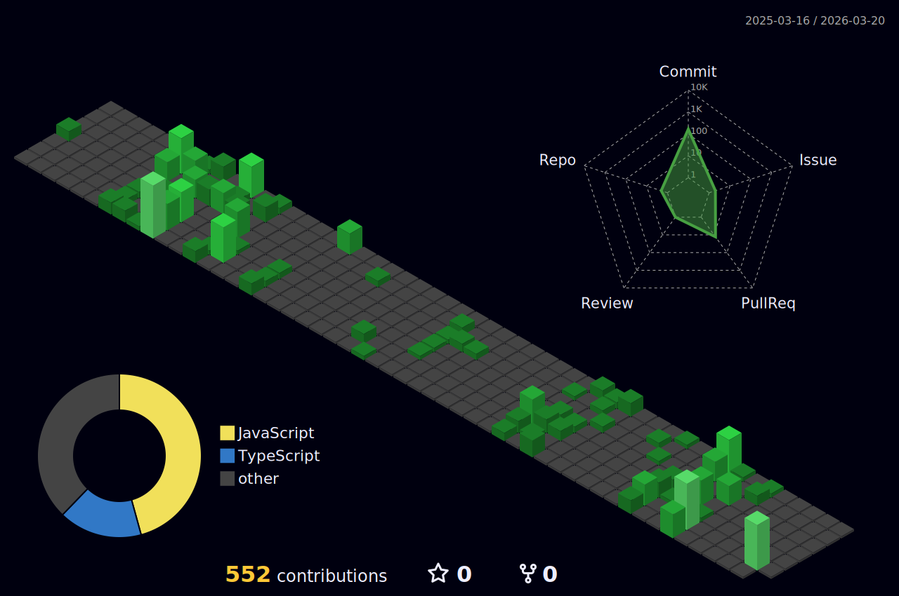

  <!-- Centered GIF / Image -->
  

      
  

  <!-- Typing Animation -->
  

    
  

<!-- -------------------------------------------- -->

<!-- Typing SVG by DenverCoder1 - https://github.com/DenverCoder1/readme-typing-svg -->

<!-- -------------------------------------------- -->

- 🏢 I'm a Full-Stack Web Developer specializing in building modern, scalable applications.  
- 👨‍💻 As an Information Systems student, I'm passionate about both frontend and backend development.  
- 💬 Ask me about JavaScript, React.js, Node.js, MongoDB, Angular, Vue.js, NestJS, SQL, and REST APIs.  
- ☕ Fun Fact: I'm a coffee lover who believes every bug fix deserves a fresh brew.  

<!-- -------------------------------------------- -->

### Connect with Me :

  
  
  

<!-- -------------------------------------------- -->

### Languages and Tools:

  
  
  
  
  
  
  
  
  
  
  
  
  
  
  
  
  
  
  
  
  
  
  
  
  
  
  
  
  
  
  
  
  
  
  
  
  

<!-- -------------------------------------------- -->

<!-- -------------------------------------------- -->

<!-- -------------------------------------------- -->

<!-- <h1 align='center'>⚡️<i>Stay awesome and keep building!</i>⚡️</h1> -->

    

